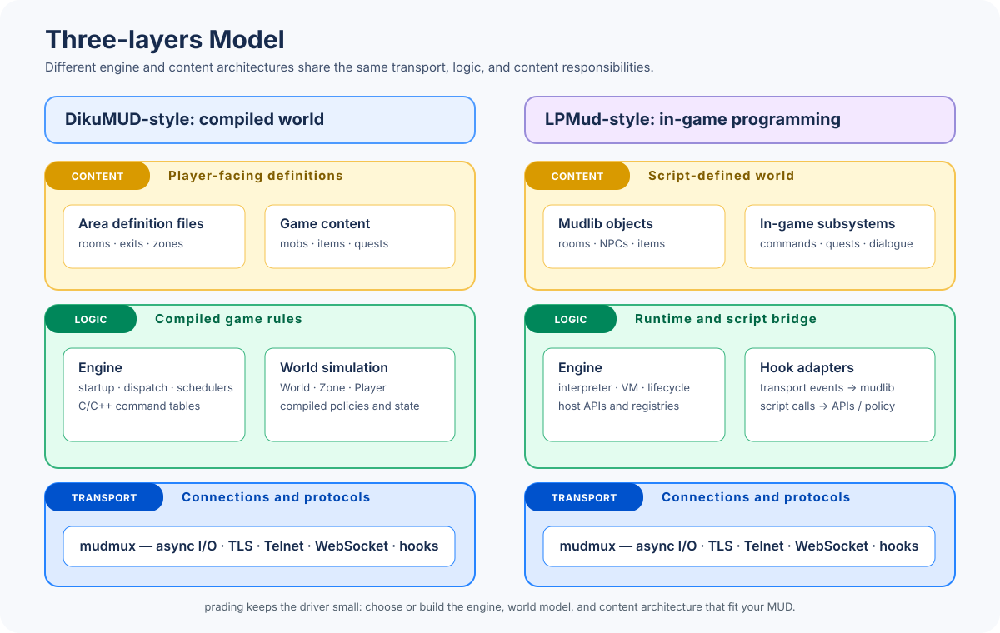

# prading

An experimental, **generic MUD foundation** for rapidly developing and extending MUDs with AI coding agents. The name `prading` means "starting" in Taiwan's Indigenous languages.

To start a new MUD project with `prading`, fork this repository.

## Bootstrap

This repository includes Git submodules for independently maintained, reusable
libraries. Fetch them after checking out the source tree:
```
git submodule update --init
```

When you fork this repository for a new MUD project, decide for each component
whether it belongs in the fork as a library or should be an independently
maintained module under `/modules`.

## Building

Use `cmake --list-presets` to view the supported build configurations.

Configure and build the project with CMake. For example:
```sh
# Configure `linux-gcc` on Linux or WSL with the GNU C++ compiler.
cmake --preset linux-gcc

# Build the configured preset at out/build/<preset-name>.
cmake --build out/build/linux-gcc
```

## Development

Although `prading` includes C++ code and CMake build scripts, its primary development focus is the **agent instructions**.
Search the source tree with string `# Agent Instructions for` to locate these instruction files.

[`AGENTS.md`](https://agents.md/) files appear throughout the source tree and its submodules.
Together with the human-facing README files, these instructions are intended to make the repository friendly to coding agents and help MUD developers **code in natural language**.

The MUD driver in `/src` is deliberately kept small and generic on the `main` branch, providing a clean starting point for new MUD forks.

> [!NOTE]
> For vibe-coding haters: No, this is not another pointless amateur AI-generated project.
>
> You still own the whole **idea**, the **architecture**, and all the **knowledge** to build a great MUD system. And, of course, you are still responsible if AI generates garbage.
>
> I believe we human need to enact [**First Principles**](https://en.wikipedia.org/wiki/First_principle) when working with AI coding agents.
> It makes the differences between *human's creation* and *AI's generation*.
> This is especially true for a MUD system that simulates a world for people to interact with each other.

## Components

A MUD system consists of several essential parts:
- **Transport layer** — Accepts user connections; handles inbound and outbound data; and implements transport protocols such as TLS, Telnet, and WebSocket.
- **Logic layer** — Routes inbound data to command handlers and delivers outbound messages to connected users. It also defines or simulates the virtual world in which users interact. This layer has evolved through many architectures and design philosophies, including AberMUD, TinyMUD, LPMud, DikuMUD, MUSH, and MOO.
- **Content layer** — Contains the player-facing parts of the MUD. It can support many styles and themes: hack-and-slash MUDs present text-based worlds where players fight monsters or one another; role-playing MUDs encourage players to inhabit their characters; and social MUDs focus primarily on social interaction.



This three-layer model describes a MUD system from a software developer's
perspective. Here, a **component** is a functional part of the MUD—such as a
transport implementation, a world simulation, or account persistence. It is
an architectural term, not a repository layout or packaging requirement.

A component may be implemented as a project-owned library in the fork, or as
an independently maintained Git submodule when it has a useful, documented API
and is intended for reuse by other MUD projects. A component may also be made
up of more than one library or module. `prading` provides a generic foundation
for composing either kind into a rapid-development codebase.
By having coding agents handle the lower layers (that is, transport and logic), MUD developers can focus on content, which benefits more from human creativity than coding skill.

## Hook Functions

Components can be implemented as project-owned libraries or as submodules in
`/modules`. Their implementations are typically assembled with hook functions:
C functions that implement the components' integration contracts.

For example, when the system receives a user command, a transport-layer component processes it and logic-layer components route it to a command handler. The handler generates messages from content-layer descriptions, then sends them to users in the same room, as defined by the logic layer, through the transport-layer API.

A MUD with *in-game programming* capabilities, such as LPMud, may wire transport-layer hooks to interpreter-based callbacks. Other MUD genres, such as DikuMUD, may implement command routing with C command tables.

The logic layer determines how hook functions connect component implementations.

## Engine

The **engine** is the driver-owned runtime that connects transport hooks to a
MUD's logic and world. Its boundary with the world is an architectural choice:
a DikuMUD-style server commonly implements game rules directly in compiled
code, while an LPMud-style server hosts an in-game runtime that lets a *mudlib*
define much of the world. Hybrid designs are common.

`prading` provides `Engine` as the small, process-wide owner for such runtime
services, alongside the [`World`/`Zone`/`Player` world model](docs/mud-world-simulation.md).
See [MUD Engine](docs/mud-engine.md) for its lifecycle, integration boundary,
and extension guidance.

## Submodules

Use a Git submodule for a component implementation only when it is intended to
be independently maintained and reused. Submodules have their own repository,
version, and public integration contract; project-specific libraries live in
the fork and do not need those boundaries. Both are valid implementations of
the same three-layer architecture.

When adding a submodule, use `modules/mudmux` as an example and:
- Expose APIs with public C headers.
- Expose integration hook functions through a C ABI.
- Document contracts in agent instructions and human-readable documentation.

The following sections describe example submodules.

### User Persistence

When a client connects to the MUD server, it commonly goes through login or character creation before entering the world.
This is usually handled by a user-account subsystem that persists identities and credentials, such as passwords.

The user-account subsystem can be an independent logic-layer component or implemented directly in an in-game scripting language, such as LPC in LPMud, when suitable data storage is available.

### World Simulation

When a user enters the MUD, the system presents a virtual world for their *player character* to interact with.

MUDs with in-game programming capabilities typically define the virtual world with "objects" in a *mudlib*.
This gives developers considerable flexibility to create varied elements of the virtual world.
However, it can blur the boundary between the logic and content layers, resulting in inconsistency across the world unless the mudlib is carefully planned and organized.

Other MUD genres, such as DikuMUD, separate logic from content by using definition files.
The *driver*, written in C, loads these files to render virtual-world content through fixed logic.

Modern commercial online game systems, such as MMORPGs, commonly use a **hybrid design**.
For example, *zones* or *areas* may use 3D maps whose definition files are shared by graphical clients and the server, alongside a *script-based quest system* that lets content editors create varied quests without recompiling the server.

How the world simulation is divided into component implementations and
architectures is a design decision. It may be a library in one MUD fork and a
reusable submodule in another.
`prading` proposes a minimum viable [**world-simulation architecture**](docs/mud-world-simulation.md) built around three C++ classes: `World`, `Zone`, and `Player`.

> [!NOTE]
>
> The world-simulation model is independent of the choice to use an
> in-game-programming architecture such as LPMud or DikuMUD. Its classes
> represent three essential software entities in a MUD system:
> - `World` is the **global game state and in-game entities** container
> - `Zone` is a **policy or spatial-segmentation** context
> - `Player` is an external **source or destination for messages**
>
> These classes can be used in DikuMUD-style, LPMud-style, or hybrid engines.

### Content Management

The content layer is usually the soul of a MUD and the reason people love it.
Content creation often continues for years throughout a MUD's life and requires a range of support from the system.

In addition to game content, the content layer includes *tools* such as combat-system calculators, quest editors, and character-build simulators.

In MUDs with in-game programming, content-management tools are usually restricted to *wizards* or *immortals*.
Modern MMORPG servers also provide GM (*game master*) commands for managing game content online.

## Testing

The project uses GoogleTest as its unit-testing framework. Use `ctest` to run the unit tests:
```sh
# Run tests for the GCC build on Linux.
ctest --test-dir out/build/linux-gcc
```

## License

The `prading` codebase and documents in this repository is released under the [MIT License](LICENSE).

### Notes about using Git submodules

Each Git submodule may have its own license terms, which apply to that submodule's repository.

A component with license requirements that differ from the MUD project—for
example, a GPL-licensed implementation—may be kept in a submodule so that its
source, notices, and distribution terms can be managed in its own repository.
That repository boundary does not by itself avoid license obligations: how the
component is linked, distributed, and exposed to users still matters. GPL
source-sharing obligations are normally triggered by conveying a program,
whereas the AGPL also addresses network use. Choose a license and integration
boundary with appropriate legal advice when a proprietary game server,
confidential content, or spoiler protection is a concern.

### Notes about using historical MUD codebase

Historical LPMud code, and some drivers derived from it, carry an additional
non-commercial restriction: the source may not be used for monetary gain. This
restriction can limit adoption and collaboration in the open-source community,
and it may make a LPMud-genre project unsuitable for commercial operation. A
separate repository or submodule does not lift the restriction; it continues to
apply wherever the covered code is used. Verify the license chain of the
specific driver and mudlib, because modern LPMud-family projects may use
different terms.
